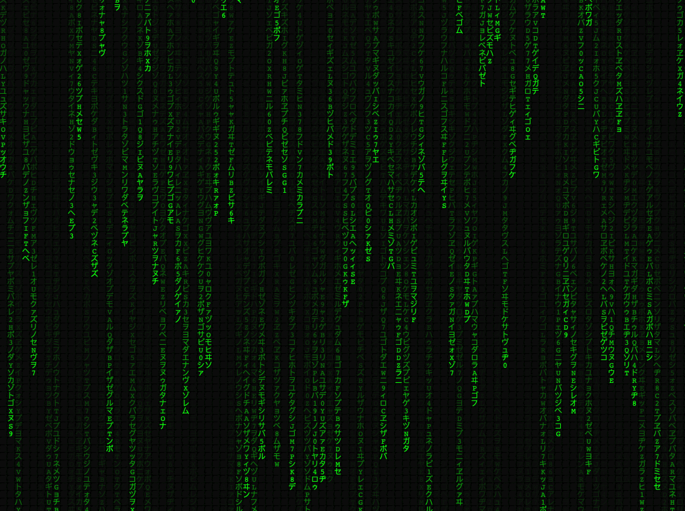

# The Matrix Rain Effect - JavaScript
_Author: Sahil David, Last updated: 11/08/22_

Checkout this Matrix Rain Effect animation using HTML Canvas & JavaScript. The source code provides a JavaScript library that exposes a class to implement the effect.



## Usage

```html
	<script src="https://cdn.stardustdesignsystem.com/js/matrix-rain.js"></script>
	<script>
		const matrix = new Matrix(options) // Please see below for configuration options

		// Draw the effect
		matrix.draw();

		// Optional: Make it responsive
		matrix.resize();
	</script>
```
## Options

While creating the instance `new Matrix({})` you can pass the following options as an object to create the effect you want.

- **matrix_symbols** `(string)` - String of characters you want to include in the rain effect. By default following are the symbols
```js
// Default Symbols
'アァカサタナハマヤャラワガザダバパイィキシチニヒミリヰギジヂビピウゥクスツヌフムユュルグズブヅプエェケセテネヘメレヱゲゼデベペオォコソトノホモヨョロヲゴゾドボポヴッン0123456789ABCDEFGHIJKLMNOPQRSTUVWXYZ';
```

- **selector** `(string)` - HTML DOM selector to draw the effect on. _Default value: 'body'_

- **backgroundColor** `(string: color-code)` - Background color. _Default value: '#010101'_

- **symbolColor** `(string: color-code)` - Symbols/Character color. _Default value: '#0aff0a'_

- **width** `(number)` - Width of canvas. _Default value: parent element width_

- **height** `(number)` - Height of canvas. _Default value: parent element height_

- **fontSize** `(number)` - Font size of falling symbols. _Default value: 14_

- **frameRate** `(number)` - Animation frame rate _Default value: 30_

- **fadeFactor** `(number)` - Fade opacity for symbols, expected value in range of 0 - 1, _Default value: 0.05_

- **fadeRandom** `(Array | number)` - For random fade behavior of old layers. Expects a range e.g. [0, 1] or 1

- **randomHeights** `(Array | number)` - For random heights of falling characters. Expects a range  for percentages of the height e.g. [0, 1] or 1

- **gradient** `(object: gradient)` - Applies gradient on all characters on the canvas. Supports only linear gradient. Expects an object as 
```js
{
	gradient: {
		type: 'linear',
		position: {
			x: 0, // number
			y: 0, // number
			width: '{{__CANVAS_WIDTH}}', // __CANVAS_WIDTH indicates to use canvas width, you can also pass a specific number
			height: '{{__CANVAS_HEIGHT}}' // __CANVAS_HEIGHT indicates to use canvas height, you can also pass a specific number
		},
		stopColors: [ // Array of colors to create gradient for
			{
				position: 0, // position of the color in gradient scale, Value in range of 0 - 1
				color: '#e20000' // color
			}
		]
	}
}
```

- **highlightTail** `(object: highlightTail)` - Highlights the last character in a falling column. Expects an object as 
```js
{
	highlightTail: {
		color: '#fff', // color to apply on last character
		threshold: 0.9 // number indicating the percentage of height to apply effect on
	}
}
```
- **setInterval** `(number)` - By default `requestAnimationFrame` is used for animation. Passing this property as number applies the `setInterval` for supplied duration. This is not recommended for optimal performance.

---
## Contribute
If you have an idea on how you can make the code better and/or add new feature, please feel free to fork the repo and submit a pull request. I look forward to your amazing code.
